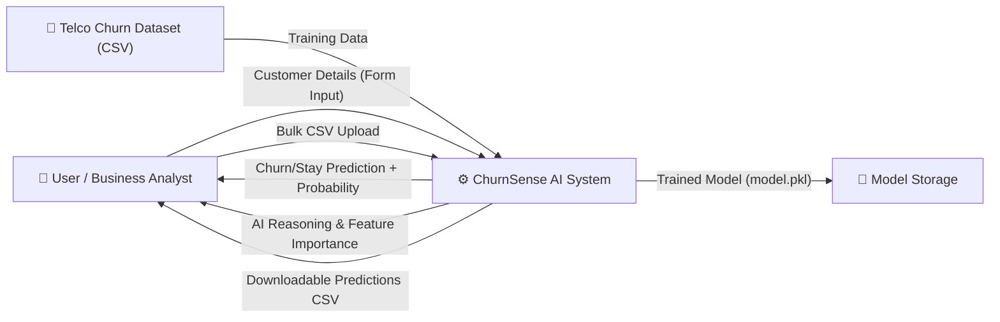
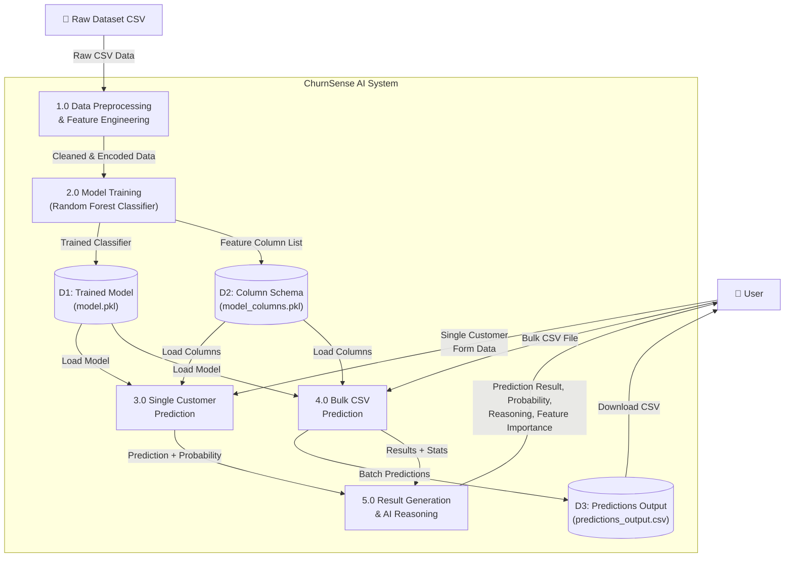
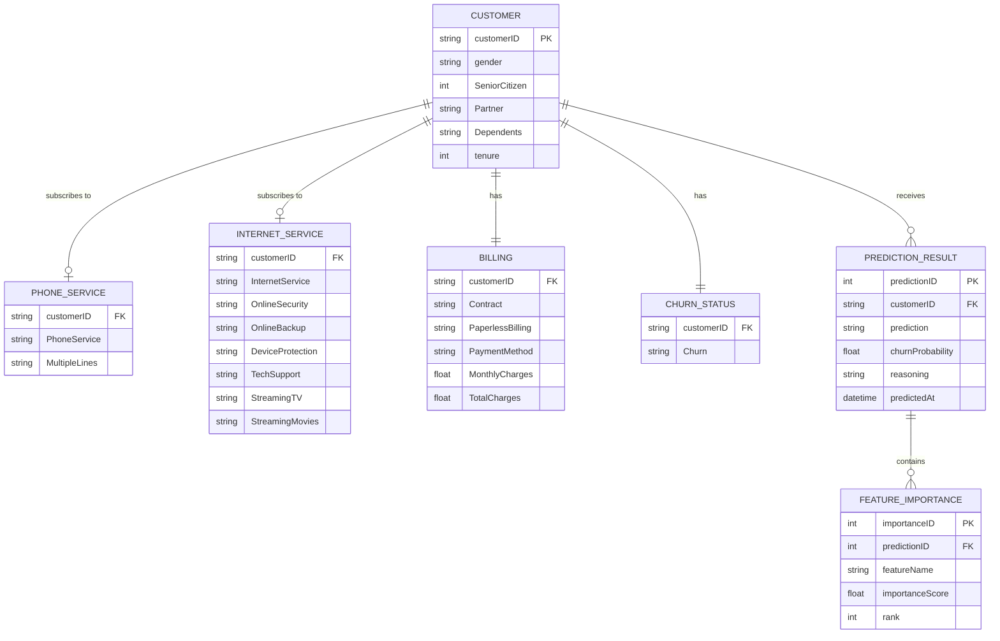
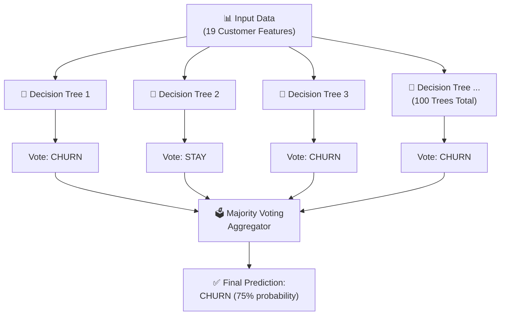
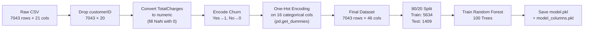

# ChurnSense AI — Diagrams & Technical Descriptions

---

## 1. Data Flow Diagrams (DFD)

### 1.1 DFD Level 0 — Context Diagram

This is the highest-level view showing the entire system as a single process with external entities interacting with it.



**Description:**
- **User / Business Analyst** interacts with the system by submitting single customer profiles via a web form or uploading bulk CSV files.
- **Telco Churn Dataset** provides historical customer data used to train the ML model.
- **ChurnSense AI System** processes inputs, runs predictions, and returns results.
- **Model Storage** stores the trained model (`model.pkl`) and column schema (`model_columns.pkl`).

---

### 1.2 DFD Level 1 — Detailed Process Diagram

This diagram breaks the system down into its core internal processes and data stores.



**Process Descriptions:**

| Process | Name | Description |
|---------|------|-------------|
| **1.0** | Data Preprocessing & Feature Engineering | Loads the raw Telco CSV, drops `customerID`, converts `TotalCharges` to numeric, maps `Churn` to binary (0/1), and applies one-hot encoding on all categorical features. |
| **2.0** | Model Training | Splits preprocessed data into 80% train / 20% test, trains a Random Forest Classifier with 100 decision trees, evaluates accuracy/precision/recall, and saves the model and column schema to disk. |
| **3.0** | Single Customer Prediction | Receives form input for 19 features, constructs a DataFrame, applies one-hot encoding, aligns columns using the saved schema, and runs the trained model to predict churn probability. |
| **4.0** | Bulk CSV Prediction | Receives an uploaded CSV file, preprocesses all rows identically to training, runs batch predictions, appends `Prediction` and `Churn Probability (%)` columns, and saves output for download. |
| **5.0** | Result Generation & AI Reasoning | Formats prediction output with color-coded badges, generates a probability meter, computes top 5 feature importances, and constructs a plain-English risk explanation. |

**Data Store Descriptions:**

| Store | Name | Description |
|-------|------|-------------|
| **D1** | Trained Model (`model.pkl`) | Serialized Random Forest Classifier saved using joblib. Contains the trained weights and decision tree structures. |
| **D2** | Column Schema (`model_columns.pkl`) | Ordered list of all feature column names after one-hot encoding. Used to align new prediction inputs to the exact format expected by the model. |
| **D3** | Predictions Output (`predictions_output.csv`) | Temporary CSV file generated during bulk prediction containing original data plus prediction results. Available for user download. |

---

## 2. ER Diagram (Entity-Relationship Diagram)

> [!NOTE]
> ChurnSense AI does not use a traditional relational database (no SQL). However, the following ER diagram represents the **logical data entities** and their relationships as they exist in the CSV dataset and application data flow.



**Entity Descriptions:**

| Entity | Description |
|--------|-------------|
| **CUSTOMER** | Core entity representing each telecom subscriber. Contains demographic attributes like gender, age group (senior citizen), partnership, and dependents status, along with tenure (months of service). |
| **PHONE_SERVICE** | Tracks whether the customer has phone service and if they subscribe to multiple phone lines. |
| **INTERNET_SERVICE** | Captures the customer's internet plan (DSL, Fiber optic, or None) along with all internet-dependent add-on services (security, backup, device protection, tech support, streaming). |
| **BILLING** | Financial and contractual data including contract type, billing method, payment type, and charges. |
| **CHURN_STATUS** | The target variable — whether the customer actually churned (left) or stayed. This is what the ML model learns to predict. |
| **PREDICTION_RESULT** | Generated by the application at runtime. Stores the model's prediction (CHURN/STAY), the probability score, and the AI-generated reasoning text. |
| **FEATURE_IMPORTANCE** | Stores the top contributing features for each prediction, including the feature name, importance score, and ranking. |

---

## 3. Tools Used

| Tool | Category | Purpose in Project |
|------|----------|-------------------|
| **Python 3.12** | Programming Language | Core development language for the entire backend, ML model training, data processing, and server logic. |
| **Visual Studio Code** | IDE / Code Editor | Primary development environment for writing, debugging, and running all project files. |
| **Flask 2.3+** | Web Framework | Lightweight Python web framework used to build the backend HTTP server, define URL routes, handle form submissions, process file uploads, and render HTML templates. |
| **Jinja2** | Template Engine | Embedded within Flask. Used to dynamically inject Python variables (predictions, probabilities, feature lists) into HTML pages at render time. |
| **pandas 2.0+** | Data Manipulation Library | Used for loading CSV files, cleaning data (handling missing values, type conversions), encoding categorical variables with `get_dummies()`, and aligning prediction input columns. |
| **NumPy 1.24+** | Numerical Computing Library | Provides underlying array operations and numerical computations used by pandas and scikit-learn internally. |
| **scikit-learn 1.3+** | Machine Learning Library | Provides the `RandomForestClassifier` algorithm, `train_test_split` for data partitioning, and evaluation metrics (accuracy, confusion matrix, classification report). |
| **joblib 1.3+** | Serialization Library | Used to save (serialize) and load (deserialize) the trained ML model (`model.pkl`) and the column schema (`model_columns.pkl`) to/from disk as binary files. |
| **HTML5** | Markup Language | Structures the two web pages — the single prediction form page and the bulk upload results page. |
| **CSS3** | Stylesheet Language | Provides all visual styling including the dark glassmorphism theme, responsive grid layouts, animated progress bars, color-coded badges, and hover effects. |
| **JavaScript (Vanilla)** | Scripting Language | Minimal usage for client-side interactivity — handles displaying the selected filename in the file upload dropzone on the bulk prediction page. |
| **Google Fonts (Outfit)** | Typography Resource | Provides the premium "Outfit" font family used across the entire UI for a modern, professional look. |
| **Git** | Version Control | For tracking code changes and collaboration. |
| **Web Browser (Chrome/Edge)** | Testing Tool | Used to access and test the application at `http://localhost:5000`. |

---

## 4. Languages Used

| Language | Usage Area | Details |
|----------|-----------|---------|
| **Python** | Backend + ML | The primary language. Used for data preprocessing (`churn_model.py`), model training, Flask server logic (`app.py`), prediction pipeline, feature importance calculation, and AI reasoning generation. |
| **HTML5** | Frontend Structure | Used in `index.html` and `bulk.html` templates to create semantic page structures — forms, tables, navigation, result panels, and KPI cards. |
| **CSS3** | Frontend Styling | Used in `style.css` to implement the complete visual design — glassmorphism effects, dark cosmic gradients, responsive layouts, animated elements, and color-coded prediction indicators. |
| **JavaScript** | Frontend Interactivity | Used minimally in `bulk.html` for displaying the selected CSV filename when a user picks a file for upload. |
| **Jinja2 Templating** | Server-Side Rendering | A Python-based templating language embedded in HTML files. Uses `{{ variable }}` for data injection and `` / `` for conditional rendering and loops. |

---

## 5. Algorithm Used — Random Forest Classifier

### 5.1 What is Random Forest?

**Random Forest** is a **supervised machine learning algorithm** that belongs to the family of **ensemble learning methods**. It works by constructing multiple **Decision Trees** during training and outputting the **majority vote** (for classification) of all the individual trees.



### 5.2 How It Works (Step-by-Step)

| Step | Process | Description |
|------|---------|-------------|
| **1** | **Bootstrap Sampling** | From the original 7,043 records, each tree randomly selects a subset of rows (with replacement). This creates diverse training sets for each tree. |
| **2** | **Feature Randomness** | At each split in a tree, only a random subset of the 46 encoded features is considered. This reduces correlation between trees and prevents overfitting. |
| **3** | **Tree Construction** | Each of the 100 decision trees independently learns rules like: *"If Contract = Month-to-month AND tenure < 12 AND MonthlyCharges > 70, then predict CHURN."* |
| **4** | **Majority Voting** | For a new customer, all 100 trees vote independently. The class (CHURN or STAY) that receives the most votes becomes the final prediction. |
| **5** | **Probability Estimation** | The proportion of trees voting for CHURN gives the probability. For example, if 78 out of 100 trees vote CHURN, the churn probability is 78%. |

### 5.3 Why Random Forest Was Chosen

| Reason | Explanation |
|--------|-------------|
| **High Accuracy** | Ensemble of 100 trees consistently outperforms single decision trees. Our model achieves ~80% accuracy. |
| **Handles Mixed Data Types** | Works seamlessly with both numerical features (tenure, charges) and categorical features (contract type, payment method) after encoding. |
| **Resistant to Overfitting** | Unlike a single deep decision tree, the averaging across 100 diverse trees reduces variance and prevents memorizing noise in the data. |
| **Feature Importance** | Automatically calculates how much each feature contributes to predictions — enabling the "Top 5 Driving Features" display in the UI. |
| **No Feature Scaling Required** | Unlike algorithms such as SVM or Logistic Regression, Random Forest does not require feature normalization or standardization. |
| **Handles Imbalanced Data** | The Telco dataset has ~73% Stay vs ~27% Churn. Random Forest handles this class imbalance reasonably well without special techniques. |

### 5.4 Model Configuration in This Project

```python
RandomForestClassifier(
    n_estimators=100,    # Number of decision trees in the forest
    random_state=42      # Seed for reproducibility
)
```

### 5.5 Model Performance Metrics

| Metric | Class 0 (STAY) | Class 1 (CHURN) | Overall |
|--------|:-:|:-:|:-:|
| **Precision** | 0.83 | 0.66 | — |
| **Recall** | 0.91 | 0.46 | — |
| **F1-Score** | 0.87 | 0.54 | — |
| **Accuracy** | — | — | **79.5%** |

### 5.6 Other Algorithms Considered (and why not chosen)

| Algorithm | Why Not Used |
|-----------|-------------|
| **Logistic Regression** | Simpler model, but lower accuracy on this dataset (~75%). Cannot capture complex non-linear relationships between features. |
| **Support Vector Machine (SVM)** | Requires feature scaling, slower to train on 7,000+ records with 46 encoded features, and does not provide feature importance natively. |
| **K-Nearest Neighbors (KNN)** | Computationally expensive at prediction time (must compare against all training samples). Poor performance on high-dimensional one-hot encoded data. |
| **Neural Network (Deep Learning)** | Overkill for a dataset of this size. Requires more data, longer training, GPU resources, and is harder to explain — not suitable for an interpretable business tool. |

---

## 6. Data Preprocessing Pipeline



| Step | Operation | Before | After |
|------|-----------|--------|-------|
| 1 | Drop `customerID` | 21 columns | 20 columns |
| 2 | Convert `TotalCharges` | String with blanks | Float with 0-fill |
| 3 | Encode `Churn` target | "Yes"/"No" strings | 1/0 integers |
| 4 | One-Hot Encode categoricals | 16 text columns | 46 binary+numeric columns |
| 5 | Train/Test Split | 7,043 rows | Train: 5,634 / Test: 1,409 |
